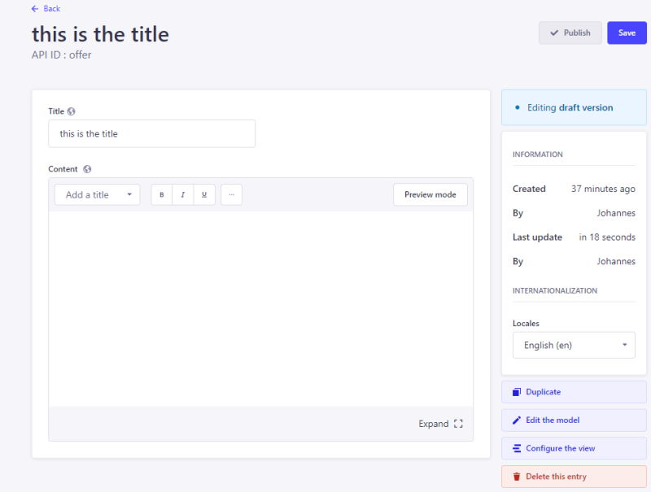

<div align="center" width="150px">
  
</div>

# Strapi Plugin Duplicate Button
> Adds a Duplicate Button to the edit view



## How to Install

Copy the following code and run from your terminal

```
#yarn
yarn add strapi-plugin-duplicate-button
```
```
#pnpm
pnpm add strapi-plugin-duplicate-button
```
```
#npm
npm install strapi-plugin-duplicate-button
```

Add the following attribute in the `config/plugins.js` file:
```
'duplicate-button': true
```
Or if you do not have the plugins.js file yet, add the file with the following contents:
```
module.exports = () => ({
  'duplicate-button': true,
});
```

## How to use
After activation of the Plugin, click the Duplicate Button in the edit view.
